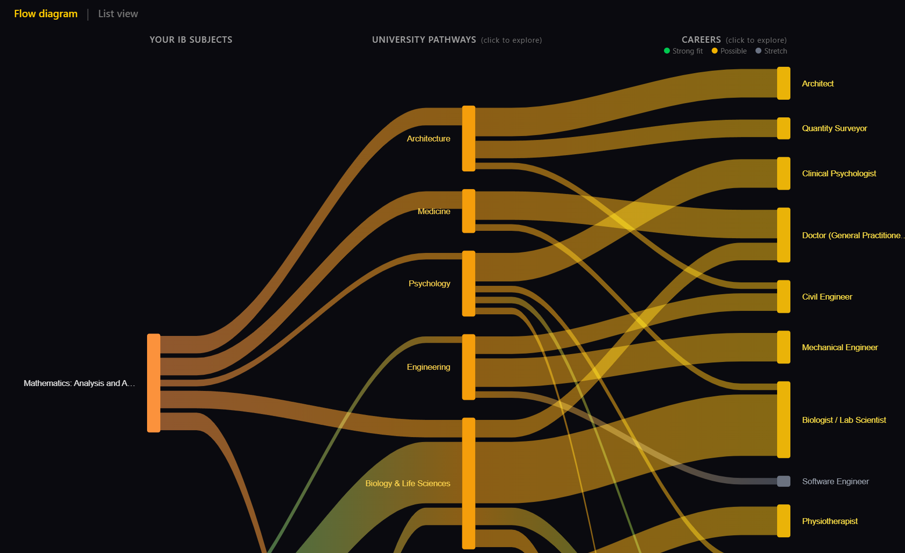

# IB Prophet

[](https://github.com/sergejf/ibprophet/actions/workflows/ci.yml)
[](LICENSE)

IB Prophet helps International Baccalaureate Diploma students explore how their subject choices connect to university pathways and AI-ready careers. Pick your HL and SL subjects, and instantly see which degrees and professions open up — with AI exposure scores, salary data, growth projections, and BLS labor market stats.

**Live:** https://ibprophet.app



## Features

- **Subject Explorer** — select 6 IB subjects (3 HL + 3 SL) and see matching university pathways via an interactive Sankey flow diagram or list view
- **Subject Info Panels** — click any subject name for an official IBO-sourced description and direct link to the IB curriculum page on ibo.org
- **Facilitating Subject Badges** — amber badges on subjects that the Russell Group identifies as keeping the widest range of university degrees open; Language B subjects show "Facilitating at HL"
- **Essential / Recommended / Useful Labels** — Sankey tooltips and pathway detail panels show whether a subject is essential, recommended, or useful for each pathway (derived from weight + hlRequired data)
- **Career Cards** — 29 careers with AI exposure scores (1-9 with rationales, inspired by [karpathy/jobs](https://github.com/karpathy/jobs)), UK/US salary ranges, BLS labor market data, 10-year growth outlook, and AI resilience tier (green/yellow/red)
- **Pathway Detail** — drill into any of the 20 university pathways to see required subjects and HL grade expectations
- **Combination Analysis** — 34+ heuristics across Strengths, Limitations, and Recommendations — including facilitating subject count, classic archetype detection (science, life sciences, physical sciences), essay workload, trade-off weaknesses, and non-facilitating warnings
- **Options-Open Score** — shows how many of 20 university pathways your subjects connect to, with open/closed pathway pills and facilitating subject guidance
- **University Benchmark** — Russell Group HL grade requirements with tier visualisation and predicted points input
- **Country Requirements** — admission rules checker for Germany (KMK), United Kingdom (UCAS/Russell Group), and Netherlands (Nuffic), with flag emoji country selector
- **Guided UX** — step indicator (1-4) with checkmarks, section headers with step numbers, "Try an example" button, "Reset selection" button, and session persistence
- **Mobile Responsive** — Sankey auto-switches to list view on mobile, header/footer/picker adapt to narrow screens
- **Accounts — not yet shipped** — `/login` and `/signup` render a "Coming soon" placeholder. Auth is not merely hidden in the UI: the `auth` and `emailSender` blocks are absent from `main.wasp`, so no `/auth/*` endpoints are mounted at all.
- **SEO-friendly URLs** — human-readable slugs (`/career/software-engineer`), not UUIDs
- **Zero friction** — no signup required; all reference data is public

## Data Sources

- [Russell Group _Informed Choices_](https://www.informedchoices.ac.uk/) — facilitating subjects, subject combination guidance
- [IB Diploma Programme](https://www.ibo.org/programmes/diploma-programme/curriculum/) — subject groups, HL/SL structure, subject descriptions
- [US Bureau of Labor Statistics](https://www.bls.gov/ooh/) — median salary, employment, growth projections, education requirements
- [DAAD / KMK](https://www.daad.de/) — German university admission rules for IB diploma holders
- [karpathy/jobs](https://github.com/karpathy/jobs) — AI exposure scoring rubric, and 7 rationales reproduced verbatim (see _Data provenance_ below)
- [uniadmissions.co.uk](https://uniadmissions.co.uk) / [num8ers.com](https://num8ers.com) — Russell Group and global university IB point ranges

### Data provenance

AI exposure rationales come from two places, and every career records which:

| `rationaleSource` | Count | Meaning                                                                    |
| ----------------- | ----- | -------------------------------------------------------------------------- |
| `OWN`             | 22    | Written for this project, scored against the BLS occupational description  |
| `KARPATHY_JOBS`   | 7     | Reproduced verbatim from [karpathy/jobs](https://github.com/karpathy/jobs) |

The distinction is surfaced in the UI rather than kept in the database: a quoted
rationale is labelled as quoted, so the 22 judgements that are ours are not
presented interchangeably with the 7 that are not.

Two caveats worth stating plainly. `karpathy/jobs` carries no licence, so it is
"all rights reserved" by default — the 7 reproduced rationales are used as
attributed quotation. They are also LLM-generated (his `score.py` scores each
occupation via OpenRouter), which is why they are quoted rather than
paraphrased: rewriting machine-generated text to obscure its origin would add
no analysis and misrepresent where the judgement came from.

The underlying BLS Occupational Outlook Handbook data is a US Government work
and in the public domain.

## Data Coverage

- **40 IB subjects** across all 6 groups (including Geography)
- **20 university pathways** (STEM, Humanities, Social Sciences, Arts)
- **29 careers** with AI exposure scores (1-9), BLS labor market stats, salary data (US & UK), AI resilience rating, pros/cons
- **3 countries** for admission requirements (Germany, UK, Netherlands)

## Tech Stack

- [Wasp](https://wasp.sh) — full-stack framework (React + Node.js + Prisma)
- PostgreSQL
- Tailwind CSS 4
- @nivo/sankey — interactive flow diagrams
- Vitest (34 tests)
- PostHog analytics
- Deployed on Fly.io (custom domain: ibprophet.app)

## Architecture

`main.wasp` is the single source of truth: it declares routes, pages, and
operations, and Wasp generates a typed RPC layer from it. A query declared
there becomes both a server function receiving `context.entities` (Prisma) and
a client hook — no REST controllers, no fetch wrappers, no hand-maintained
API types. That removes most of the boilerplate a small full-stack app would
otherwise carry.

```
seed-data.json ──► Prisma ──► Postgres
                                 │
                    src/*/operations.ts   (server: queries + actions)
                                 │        generated typed RPC
                    src/*/Page.tsx        (client: useQuery)
```

Code is organised per feature rather than per type — `src/explorer/`,
`src/career/`, `src/auth/` each hold their page, components, and operations
together, with `src/shared/` for cross-cutting pieces.

**Pure computation is separated from React.** The subject-combination analysis
(`src/explorer/SubjectReport.tsx` → `analyseSubjects`) and the flow-diagram
builder (`src/explorer/sankey-utils.ts`) are plain functions over plain data.
That is why the 34 tests run in ~200ms with no database, no browser, and no
Wasp SDK — the interesting logic never touches the DOM.

### Decisions and tradeoffs

- **Reference data lives in `seed-data.json`, not a CMS.** 40 subjects, 20
  pathways, 29 careers, changing rarely. Keeping it in the repo means data
  changes are reviewable in a pull request and testable in CI. It would be the
  wrong call at 10× the size or with non-technical editors.
- **No SSR or prerendering.** Google indexes SPAs, and `public/llms.txt`
  handles the AI crawlers that don't execute JavaScript. Adding SSR would have
  meant a heavier framework for no measurable reach.
- **`pros` / `cons` are JSON-encoded strings, not a native Postgres `Json`
  column.** A pragmatic early shortcut that is now a known wart — it pushes
  `JSON.parse` into the page component. Worth migrating.
- **Deploys go through `deploy.sh`, never `wasp deploy` directly.** The Wasp
  server runs `prisma migrate deploy` on boot, so deploying against a stopped
  database puts the machine into a restart loop that needs manual recovery.
  The script health-checks the database first and re-pins VM memory to 256MB
  afterwards, which Wasp's generated `fly.toml` otherwise resets to 1GB.

### Operating cost

The app is built to a fixed cost ceiling rather than for scale. Observed
running cost has stayed under $5/month on Fly.io. Three properties hold that
ceiling, and they are design decisions rather than defaults.

**Compute is fixed, not elastic.** One `shared-cpu-1x` 256MB machine per app —
client, server, database — in a single region with no redundancy.
`auto_stop_machines` idles them when there is no traffic, and the client runs
`min_machines_running = 0`, so it scales to zero. `deploy.sh` re-pins memory to
256MB after every deploy, because Wasp's generated `fly.toml` resets it to 1GB.

**Storage cannot grow.** The app has no write path. All three operations are
queries, and there is no `create`, `update` or `delete` outside the seed
script. The database holds a read-only reference dataset, seeded at deploy
time. No accounts, no uploads, no user-generated rows — so no amount of traffic
increases what is stored. This is also why the unshipped auth was removed
rather than left mounted: an open signup endpoint is an unbounded write path.

**Inputs are bounded before they reach the database.** `getPathwaysForSubjects`
rejects a subject list longer than 6 before issuing a query, so a crafted
request cannot fan out into an expensive one.

What this deliberately gives up: there is no autoscaling, so a real traffic
spike degrades latency instead of inflating the bill. For a tool serving a few
hundred students, that is the right way round.

The honest remaining exposure is bandwidth. Egress is metered, and there is no
rate limiting on the query endpoints — sustained hammering would show up as
egress and machine-hours, not as storage or scaled-out compute. At this traffic
level it is immaterial, but it is the one line that could move, and it is worth
naming rather than claiming the cost is bulletproof.

## Development

### Prerequisites

- Node.js (LTS)
- Wasp CLI: `npm i -g @wasp.sh/wasp-cli@latest`
- PostgreSQL (or use `wasp start db` for a Docker-managed instance)

### Setup

```bash
# Start the database
wasp start db

# Run migrations and seed data
wasp db migrate-dev --name init
wasp db seed

# Start the dev server
wasp start
```

The app runs at `http://localhost:3000`.

### Configuration

No environment variables are required for local development — `wasp start db`
provisions a Docker-managed Postgres and injects `DATABASE_URL` for you. See
`.env.server.example` for the optional overrides and the production variables.

### Checks

```bash
npm test          # vitest (34 tests)
npm run lint      # eslint, zero warnings tolerated
npm run format    # prettier --write
```

These run on every push and pull request via GitHub Actions
([`.github/workflows/ci.yml`](.github/workflows/ci.yml)), and on every commit
via a Husky pre-commit hook that also runs `gitleaks`.

### Deployment

```bash
./deploy.sh          # Full deploy with pre-flight checks
./deploy.sh --check  # Pre-flight checks only (no deploy)
./deploy.sh --server # Server only
./deploy.sh --client # Client only
```

Always use `deploy.sh` — never run `wasp deploy fly deploy` directly. The script checks database health before deploying to prevent server crash loops, and auto-resizes machines back to 256MB (Wasp defaults to 1GB).

## License

**Code** is MIT licensed — see [LICENSE](LICENSE).

**Data is not.** The MIT grant covers the application source only. The
reference dataset in `src/shared/seed-data.json` aggregates third-party
material that is not mine to relicense:

- BLS Occupational Outlook Handbook figures — US Government work, public domain
- 7 AI-exposure rationales quoted from [karpathy/jobs](https://github.com/karpathy/jobs), which carries no licence (see [Data provenance](#data-provenance))
- University entry requirements compiled from published admissions guidance

Reuse the code freely. For the dataset, go to the original sources.

IB Prophet is not affiliated with, endorsed by, or connected to the
International Baccalaureate Organization, the Russell Group, or any university
or employer named in the data. "International Baccalaureate" and "IB" are
trademarks of the IBO.
